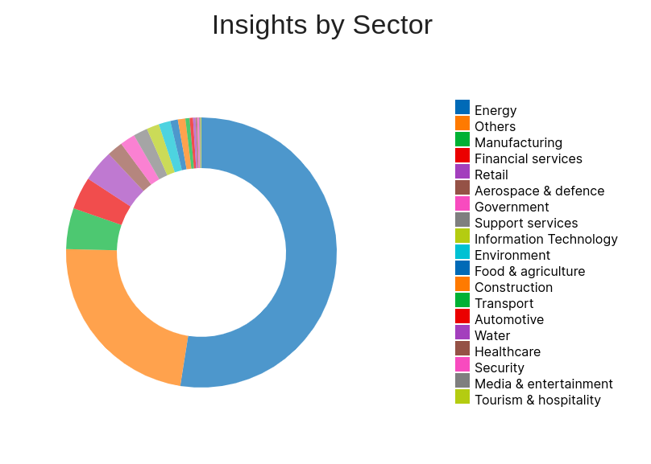
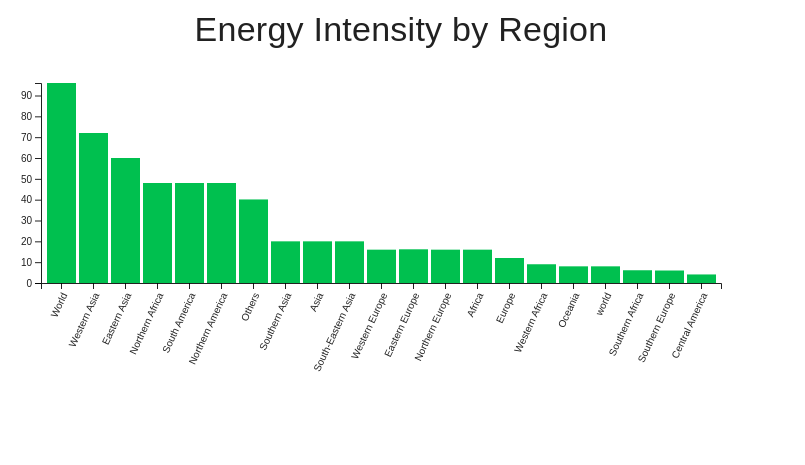
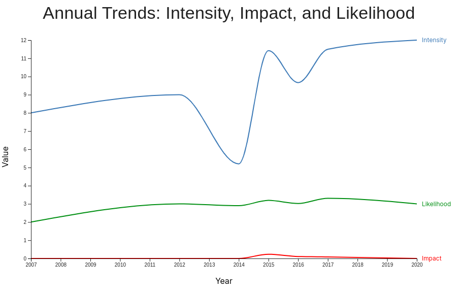

```markdown
# Data Visualization Dashboard

This project presents a full-stack application for visualizing data trends. It is built using the MERN stack with Vite, React, TypeScript, and MongoDB. The application includes a series of interactive charts, enabling insightful analysis across various metrics.

## Project Structure

The backend server runs on Node.js and Express, interfacing with a MongoDB database using Mongoose. The frontend is built with React and MUI, offering a responsive and modern UI/UX.

## Features

- Visualize data in interactive charts.
- Filter views for different datasets.
- Responsive and modern user interface.

## Getting Started

These instructions will get you a copy of the project up and running on your local machine for development and testing purposes.

### Prerequisites

- Node.js
- npm or yarn
- MongoDB

### Installing

#### Backend

Navigate to the backend directory:

```bash
cd backend
```

Install dependencies:

```bash
npm install
```

Start the MongoDB server (make sure MongoDB is installed):

```bash
mongod
```

Run the backend server:

```bash
npm start
```

#### Frontend

Navigate to the frontend directory:

```bash
cd frontend
```

Install dependencies:

```bash
npm install
```

Start the development server:

```bash
npm run dev
```

### Environment Variables

Create a `.env` file in the root of your backend directory and add the following:

```env
MONGODB_URI=your_mongodb_uri
PORT=5000
```

## Usage

After starting the backend and frontend servers, navigate to `http://localhost:3000` to access the Data Visualization Dashboard.

## Built With

- [Vite](https://vitejs.dev/) - Frontend build tool
- [React](https://reactjs.org/) - Frontend web framework
- [TypeScript](https://www.typescriptlang.org/) - Static type checking
- [MUI](https://mui.com/) - Material-UI for React components
- [MongoDB](https://www.mongodb.com/) - NoSQL database
- [Mongoose](https://mongoosejs.com/) - MongoDB object modeling for Node.js
- [Express](https://expressjs.com/) - Web application framework for Node.js

## Screenshots

Here are some of the visualizations you can expect from the dashboard:






## Authors

- **Brijesh Kumar** - *Initial work* - [GitHub](https://github.com/YourGitHub)


## License

This project is licensed under the MIT License - see the [LICENSE.md](LICENSE.md) file for details.

